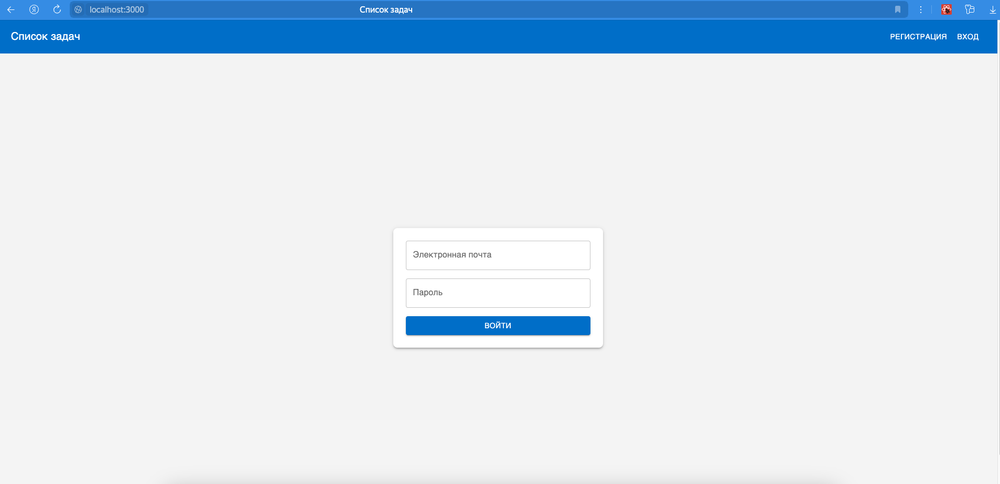

# Список задач
Приложение для создание, просмотра, редактирования списка задач с авторизацией, создано на React, Typescript, Express, MongoDB
##  Структура проекта
- backend - серверная часть приложения, подробная информация описана в readme backend
- frontend - клиентская часть приложения, подробная информация описана в readme frontend

## Запуск приложения

Для запуска приложения, необходимо чтобы у вас был установлен Docker, перейти в папку проекта (taskmanager) и выполнить команду:
### `docker-compose up --build`
Приложение будет доступно по адресу: http://localhost:3000
Сервер будет доступен по адресу: http://localhost:5000

## Документация приложения
#### Страница входа

#### Страница регистрации

#### Всплывающее окно при успешной регистрации или ошибки

#### Страница cо списком задач

#### Нажав на кнопку добавить, откроется модальное окно добавления

#### Нажав на карандаш напротив строки, откроется модальное окно редактирования

#### Нажав на удаление напротив строки, удалится строка

#### Нажав на галочку (черточку) напротив строки, поменяется статус задачи

#### Доступна фиильтрация по столбцу статусов и сортировка по всем столбцам

